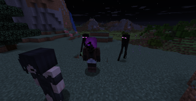
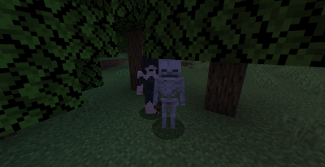
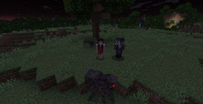
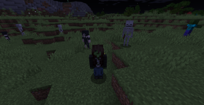

# Cursed Mob Waifus
Download at [CurseForge](https://www.curseforge.com/minecraft/mc-mods/cursedmobwaifus) or [Modrinth](https://modrinth.com/mod/cursedmobwaifus)

**Cursed Mob Waifus** is a novel Minecraft 1.16 mod for Fabric based on a few old "monster girl" texture packs, which re-textured monsters to look like girls.

This mod adds so called "Waifus", that are human-looking mobs which are inspired by their respective mob types.  
The Waifus spawn with a configurable chance (standard is 10%) next to their mob equivalent to protect them.  
When the mobs are killed, the Waifus can be tamed using flowers by the player.

**Note:** This mod is not meant to make fun of females in any way. It is merely a joke, hence why we coded it on April 1st.

Written in [LOLCODE](http://www.lolcode.org/), I think.

## Screenshots

